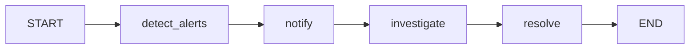
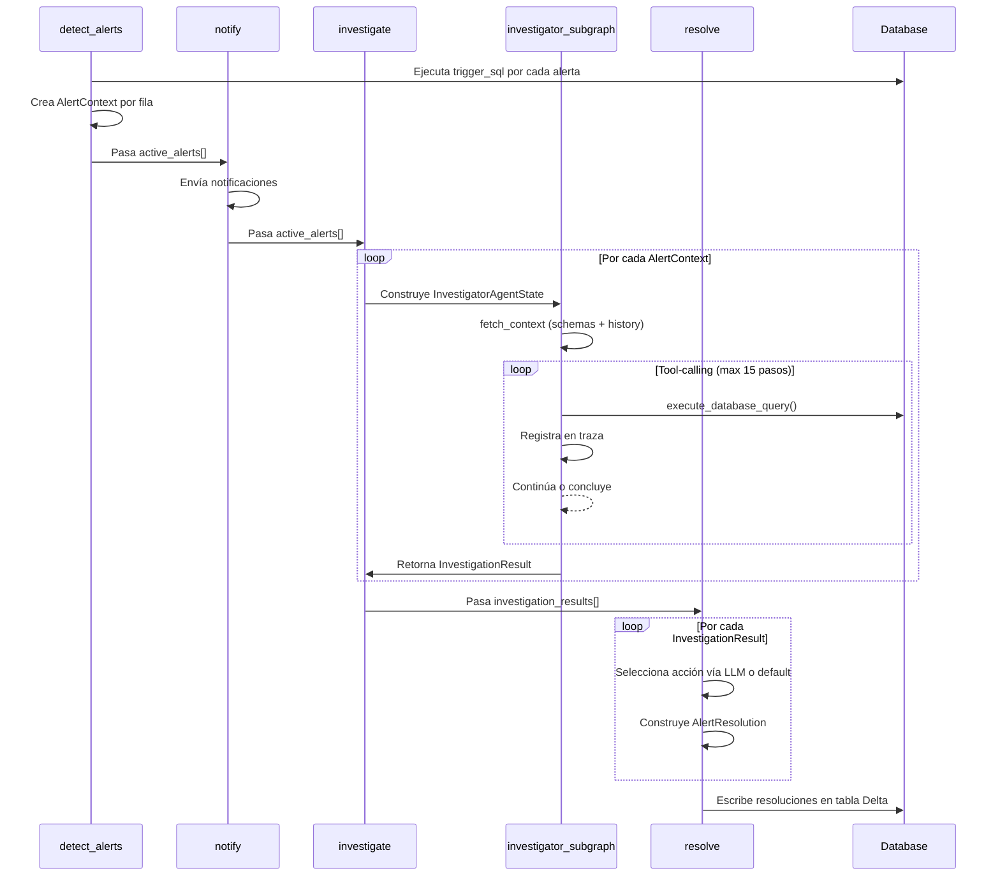
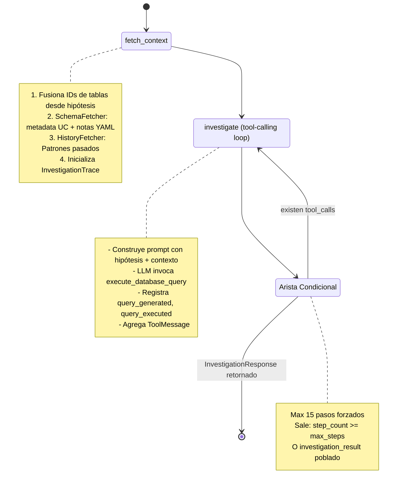
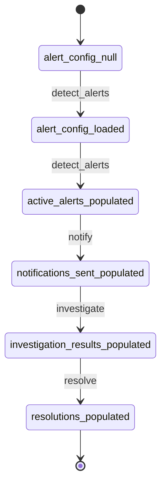
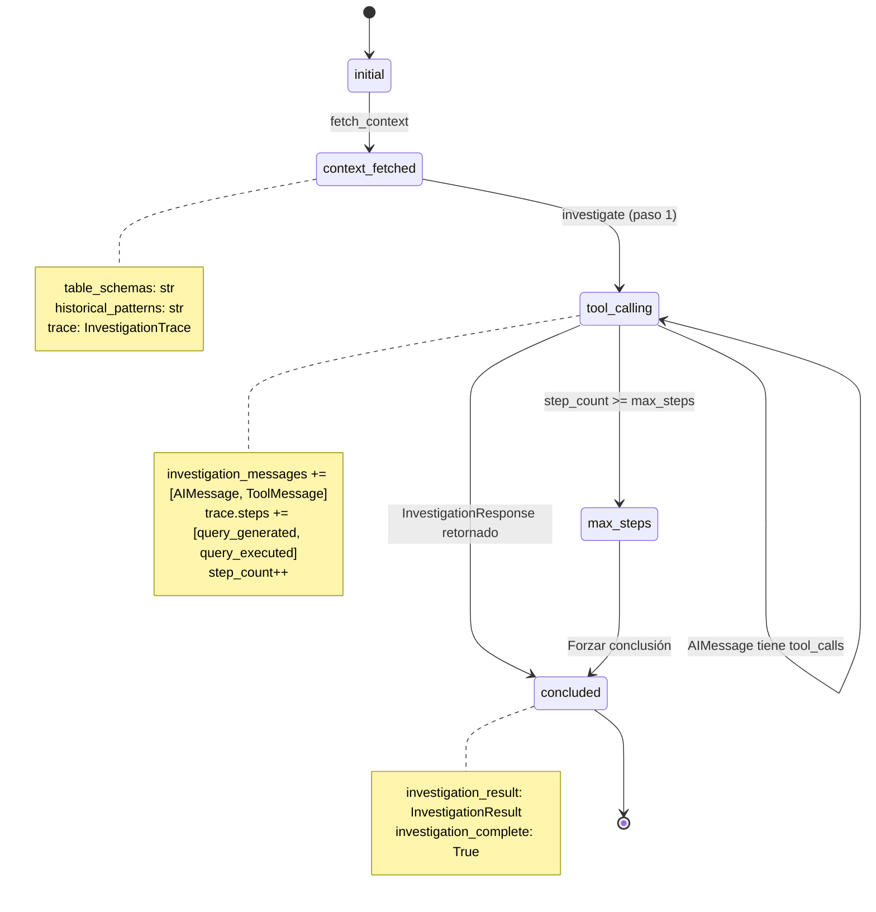
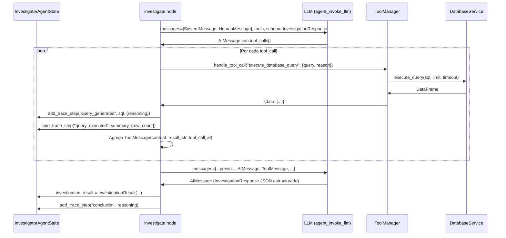

# Alert Agent Framework - Documento de Descubrimiento Técnico

**Proyecto:** LABS-3528 - Alert Agent Framework  
**Autor:** Revisión Arquitecto de Software Senior  
**Fecha:** 2026-04-30  
**Propósito:** Validación Spike - verificar que la implementación generada por Linguo se alinea con el diseño arquitectónico

---

## Resumen Ejecutivo

Alert Agent Framework implementa arquitectura de dos grafos:
1. **Grafo Coordinador**: Orquesta pipeline (detect → notify → investigate → resolve)
2. **Subgrafo Investigador**: Loop agéntico único con llamadas a herramientas para análisis de causa raíz

**Hallazgo Clave:** Implementación lista para producción con registro completo de traza, integración Unity Catalog, priorización de patrones históricos, y gestión de estado apropiada. Sin bloqueos. Existen oportunidades de pulido menores.

---

## 1. Flujo de Arquitectura

### 1.1 Pipeline General



**Archivo:** `packages/alert-agent/src/alert_agent/graphs/coordinator/graph_builder.py:22-45`

### 1.2 Flujo de Alerta Individual (detect_alerts → resolve)



### 1.3 Detalle Subgrafo Investigador



**Archivos:**
- `investigator/graph_builder.py:20-62`
- `investigator/nodes/fetch_context.py:23-63`
- `investigator/nodes/investigate.py:25-211`

---

## 2. Análisis de Integridad de Modelos

### 2.1 Soporte de Traza de Investigación ✅

**Modelos Pydantic:**
```python
# models/schemas.py:100-118
class TraceStep(BaseModel):
    step_number: int
    timestamp: datetime
    step_type: str  # "query_generated", "query_executed", "reasoning", "conclusion"
    content: str
    metadata: Dict[str, Any]

class InvestigationTrace(BaseModel):
    alert_event_id: str
    steps: List[TraceStep]
    total_queries_executed: int
    total_duration_seconds: float
    hypotheses_explored: List[str]
```

**Implementación de Registro:**
- `investigator_state.py:60-79` - Helper `add_trace_step()`
- `investigate.py:151` - Registra `query_generated` con SQL + razonamiento
- `investigate.py:166` - Registra `query_executed` con conteo de filas
- `investigate.py:192` - Registra `conclusion` con razonamiento final

**Veredicto:** ✅ Registro completo de traza en cada paso. `InvestigationTrace` embebido en `InvestigationResult`, serializado a JSON en `AlertResolution.investigation_trace` (resolve.py:98).

### 2.2 Loop Agéntico Único ✅

**Requerimiento de Diseño:** Sin iteración por hipótesis. Agente recibe TODAS las hipótesis por adelantado y auto-navega.

**Evidencia de Implementación:**
```python
# investigator/nodes/investigate.py:62-74
formatted_hypotheses = ""
for i, hypothesis in enumerate(state.hypotheses):
    formatted_hypotheses += (
        f"{i + 1}. [{hypothesis.id}] {hypothesis.name}\n"
        f"   Description: {hypothesis.description}\n"
        f"   Investigation Guidance: {hypothesis.investigation_guidance}\n"
    )
formatted_hypotheses += f"{len(state.hypotheses) + 1}. [other] Other\n"
```

**Construcción de Prompt:** `investigate.py:79-102` - Mensaje system + user construido una vez con todas las hipótesis. Sin ramificación por hipótesis en grafo.

**Salida LLM:** Retorna `InvestigationResponse` con campo `root_cause_hypothesis` (uno de los IDs de hipótesis o "other").

**Veredicto:** ✅ Loop agéntico único. LLM elige autónomamente qué hipótesis investigar vía llamadas a herramientas.

---

## 3. Puntos de Integración con genie-core

### 3.1 Ejecución de Base de Datos

**Adaptador:** `genie_core.adapters.database.get_database_service()`

**Puntos de Uso:**
1. `detect_alerts.py:88,102` - Ejecuta trigger SQL, retorna pandas DataFrame
2. `fetch_context.py:126` - SchemaFetcher usa `db_service.get_table_schema(table_id)`
3. `history_fetcher.py:49,99` - Ejecuta consulta de patrones históricos
4. `tools.py:42,95` - DatabaseQueryTool envuelve `db_service.execute_query()` con verificaciones de seguridad

**Manejo de Errores:**
- `QueryExecutionError` - Capturado en detect_alerts (L120), tools (L102)
- `TableNotFoundError` - Capturado en SchemaFetcher (L78), HistoryFetcher (L100), tools (L153)

**Seguridad:** `tools.py:45-56` fuerza solo-lectura (SELECT/WITH/DESCRIBE/SHOW/EXPLAIN), bloquea DROP/DELETE/UPDATE/INSERT/ALTER/TRUNCATE.

### 3.2 Llamadas a Herramientas LLM

**Adaptador:** `genie_core.adapters.llm.get_llm_service()`

**Puntos de Uso:**
1. `investigate.py:107,112` - `agent_invoke_llm(messages, InvestigationResponse, tools=tools)`
   - Retorna AIMessage con `tool_calls` o respuesta estructurada
2. `resolve.py:62` - `prompt_invoke_llm(user_prompt, system_prompt, output_schema=SuggestResolutionResponse)`
   - Salida estructurada para selección de acción

**Schema de Herramientas:** `tools.py:263-315` - Schemas de función LiteLLM para `execute_database_query` y `get_table_schema`

**Veredicto:** ✅ Integración LangChain/LiteLLM apropiada. Manejo de llamadas en `investigate.py:131-177` parsea AIMessage, ejecuta vía ToolManager, agrega ToolMessage.

---

## 4. Verificación de Características

### 4.1 History Fetcher: Priorización de Investigaciones Pasadas ✅

**Clase:** `utils/history_fetcher.py:22-159`

**Lógica:**
```sql
SELECT root_cause_hypothesis, reasoning, COUNT(*) as occurrence_count
FROM {output_schema}.alert_investigations
WHERE alert_id = '{alert_id}'
  AND root_cause_found = true
  AND created_at >= date_sub(current_date(), {lookback_days})
GROUP BY root_cause_hypothesis, reasoning
ORDER BY occurrence_count DESC
LIMIT 5
```

**Formato de Salida:**
```
HISTORICAL PATTERNS:
This alert type has been investigated 42 times in the past 90 days.
Most common root causes:
- "data_freshness_lag" — confirmed 29 times (69%)
  Typical finding: Upstream pipeline delayed by 4+ hours
- "schema_change" — confirmed 8 times (19%)
  ...
```

**Integración:** `fetch_context.py:54` llama `history_fetcher.fetch_patterns(alert_id)`, inyectado en `state.historical_patterns`, pasado a prompt LLM (investigate.py:96).

**Configuraciones:**
- `ENABLE_HISTORICAL_PATTERNS=True` (config.py:111)
- `HISTORICAL_LOOKBACK_DAYS=90` (config.py:116)

**Veredicto:** ✅ Priorización implementada. LLM recibe estadísticas de frecuencia ("69% de alertas pasadas"). Maneja graciosamente tabla-no-encontrada (primera ejecución) y retorna None.

### 4.2 Schema Fetcher: Unity Catalog + Notas YAML ✅

**Clase:** `utils/schema_fetcher.py:17-112`

**Lógica de Fusión:**
```python
# L68-77: Obtiene schema UC
schema = database_service.get_table_schema(table_config.id)
for col_name, col_meta in schema.items():
    col_type = col_meta.get("type")
    description = col_meta.get("description") or ""
    lines.append(f"- {col_name} ({col_type}) — {description}")

# L94-98: Agrega notas YAML
if table_config.notes:
    lines.append("Notes:")
    for note in table_config.notes:
        lines.append(f"- {note}")
```

**Fuente de Notas YAML:** `models/schemas.py:19-29` - `TableConfig.notes: List[str]` cargado desde YAML del cliente.

**Ejemplo de Salida:**
```
Table: catalog.schema.fct_orders
Columns:
- order_id (BIGINT) — Primary key
- customer_id (BIGINT) — FK to dim_customer
- order_date (DATE)

Notes:
- Grain: one row per order_id
- Joins to dim_product on product_key
```

**Integración:** `fetch_context.py:51` → `SchemaFetcher.fetch_all(table_configs)` → `state.table_schemas` → prompt LLM (investigate.py:95).

**Veredicto:** ✅ Fusión correcta. UC provee schema autoritativo, YAML agrega contexto de negocio (granularidad, joins, reglas).

### 4.3 Registro de Traza: Generación SQL + Resultados ✅

**Implementación:** `investigate.py:131-184`

**Puntos de Registro:**

1. **Query Generado** (L151):
```python
sql = arguments.get("query", "")
reason = arguments.get("reason", "")
state.add_trace_step("query_generated", sql, {"reasoning": reason})
```

2. **Query Ejecutado** (L160-166):
```python
tool_call_result = tool_manager.handle_tool_call(tool_name, arguments)
row_count = len(tool_call_result.get("data", []))
summary = f"Query returned {row_count} rows."
state.add_trace_step("query_executed", summary, {"row_count": row_count})
```

3. **Conclusión** (L192):
```python
state.add_trace_step("conclusion", content.get("reasoning", ""))
```

**Helper de Traza:** `investigator_state.py:60-79` - Agrega `TraceStep` con `step_number` auto-incrementado y timestamp UTC.

**Persistencia:** `resolve.py:98` - `investigation_trace=inv_result.trace.model_dump_json()` serializa traza completa a tabla Delta.

**Veredicto:** ✅ Llamadas a herramientas (SQL + razonamiento) y resultados (conteo de filas) agregados a traza en cada paso. Conclusión registrada cuando loop termina.

---

## 5. Análisis de Brechas

### 5.1 Sin Brechas Bloqueantes

- ✅ Aristas de grafo correctamente conectadas (coordinador: lineal, investigador: loop condicional)
- ✅ Modelos de estado soportan todos los campos requeridos (traza, hipótesis, contexto)
- ✅ Adaptadores genie-core apropiadamente importados y con manejo de errores
- ✅ Verificaciones de seguridad en SQL (solo-lectura, patrones de inyección bloqueados)
- ✅ Protección de timeout (`INVESTIGATION_TIMEOUT_SECONDS`, `max_steps`)

### 5.2 Oportunidades de Pulido Menores

#### 5.2.1 Campos Sin Usar
- `InvestigationTrace.total_queries_executed` (L115) - Nunca incrementado, siempre 0
- `InvestigationTrace.total_duration_seconds` (L116) - Nunca calculado, siempre 0.0
- `InvestigationTrace.hypotheses_explored` (L117) - Nunca poblado, siempre []

**Impacto:** Bajo. Son campos de telemetría. Traza principal (steps[]) está completa.

**Recomendación:** O implementar o documentar como "reservado para uso futuro".

#### 5.2.2 Detección de Plataforma Hardcodeada
`investigate.py:51-57` mapea enum `DATABASE_BACKEND` a string `"gcp"` o `"databricks"`. Pasado a prompt LLM para hints de dialecto.

**Riesgo:** Bajo. Funciona para backends actuales (BigQuery, Databricks SQL).

**Mejora:** Extraer a método de adaptador `database_service.get_platform_name()` para extensibilidad.

#### 5.2.3 Nodo de Notificación Stub
`coordinator/nodes/notify.py` probablemente stub (no revisado en este spike). Verificar integración email/Slack coincide con config (L65-105 en config.py).

#### 5.2.4 Error Tipográfico en resolve.py:104
```python
return {"alert_resolutions": resolutions}  # Línea 104
```
**Problema:** Estado coordinador espera `resolutions` (L31-34 en coordinator_state.py), pero esto retorna `alert_resolutions`.

**Impacto:** ALTO - Actualización de estado fallará. Probable descuido.

**Corrección Requerida:**
```python
return {"resolutions": resolutions}
```

### 5.3 TODOs/FIXMEs

**Resultado:** Ninguno encontrado (scan grep retornó vacío).

### 5.4 Casos Borde Manejados

- ✅ Resultados trigger vacíos (detect_alerts itera sobre 0 filas graciosamente)
- ✅ Falla en carga de config de alerta (lanza excepción, registrada)
- ✅ Tabla no encontrada en UC (SchemaFetcher regresa a solo-notas)
- ✅ Tabla histórica no encontrada (primera ejecución, retorna None)
- ✅ Max pasos alcanzado (fuerza conclusión vía flag `max_iterations=True`, L111-116)
- ✅ Falla de subgrafo (investigate.py:79-84 captura excepción, registra, continúa siguiente alerta)

---

## 6. Mapa de Transición de Estados

### 6.1 CoordinatorAgentState



**Campos Actualizados:**
- `detect_alerts`: `alert_config`, `active_alerts`
- `notify`: `notifications_sent`
- `investigate`: `investigation_results`
- `resolve`: `resolutions` (BUG: actualmente retorna key incorrecta)

### 6.2 InvestigatorAgentState



---

## 7. Referencia de Archivos Críticos

| Archivo | Propósito | Lógica Clave |
|---------|-----------|--------------|
| `models/schemas.py:100-118` | Modelos de traza | `TraceStep`, `InvestigationTrace` |
| `models/schemas.py:125-136` | Modelo de resultado | `InvestigationResult` embebe traza |
| `models/schemas.py:138-156` | Modelo de salida | `AlertResolution` para escritura Delta |
| `models/output_schemas.py:18-52` | Respuesta LLM | `InvestigationResponse` (salida estructurada) |
| `utils/investigator_state.py:60-79` | Helper de traza | Método `add_trace_step()` |
| `utils/history_fetcher.py:52-125` | Patrones históricos | Query SQL + formateo |
| `utils/schema_fetcher.py:50-112` | Fusión de schema | Metadata UC + notas YAML |
| `tools/tools.py:26-260` | Herramienta database | Wrapper de seguridad SQL + ejecución |
| `graphs/investigator/nodes/investigate.py:25-211` | Loop principal | Tool-calling + registro de traza |
| `graphs/coordinator/nodes/resolve.py:24-104` | Selección de acción | Routing LLM + construcción AlertResolution |

---

## 8. Preparación para Despliegue

### 8.1 Checklist de Producción

- ✅ Manejo de errores (database, LLM, schema fetch todos envueltos)
- ✅ Timeouts configurados (`INVESTIGATION_TIMEOUT_SECONDS`, query timeout)
- ✅ Forzamiento solo-lectura (verificaciones seguridad SQL)
- ✅ Logging (llamadas logger en niveles debug/info/warning/error)
- ⚠️ **Corrección Crítica:** resolve.py:104 desajuste de key (`alert_resolutions` → `resolutions`)
- ⚠️ Nodo notificación no verificado (revisión separada necesaria)
- ⚠️ Campos telemetría incompletos (duración, conteo queries, hypotheses_explored)

### 8.2 Requerimientos de Configuración

**Deben configurarse:**
- `ALERT_CONFIG_PATH` - Ruta al YAML del cliente
- `DATABASE_BACKEND` - Databricks o BigQuery
- `OUTPUT_SCHEMA` - Dónde escribir tabla alert_investigations

**Opcionales (con defaults):**
- `MAX_INVESTIGATION_STEPS=15`
- `ENABLE_HISTORICAL_PATTERNS=True`
- `HISTORICAL_LOOKBACK_DAYS=90`

---

## 9. Conclusión

**Evaluación General:** 🟢 Lista para producción con una corrección crítica.

**Fortalezas:**
- Separación limpia: coordinador (orquestación) vs investigador (análisis)
- Loop agéntico único funciona según diseño
- Registro completo de traza implementado correctamente
- Priorización de patrones históricos funcional
- Fusión de schemas (UC + YAML) correcta
- Integración apropiada con genie-core con manejo de errores

**Bloqueador:**
- **resolve.py:104** - Corregir key de estado (`alert_resolutions` → `resolutions`)

**Post-Lanzamiento:**
- Implementar campos de telemetría (duración, conteo queries, hypotheses_explored)
- Verificar nodo de notificación (email/Slack)
- Considerar extraer detección de plataforma a adaptador

**Recomendación:** Corregir key en resolve.py, agregar test de integración para actualizaciones de estado coordinador, luego desplegar.

---

## Apéndice A: Código Fuente Mermaid (Detalle Loop Tool-Calling)


